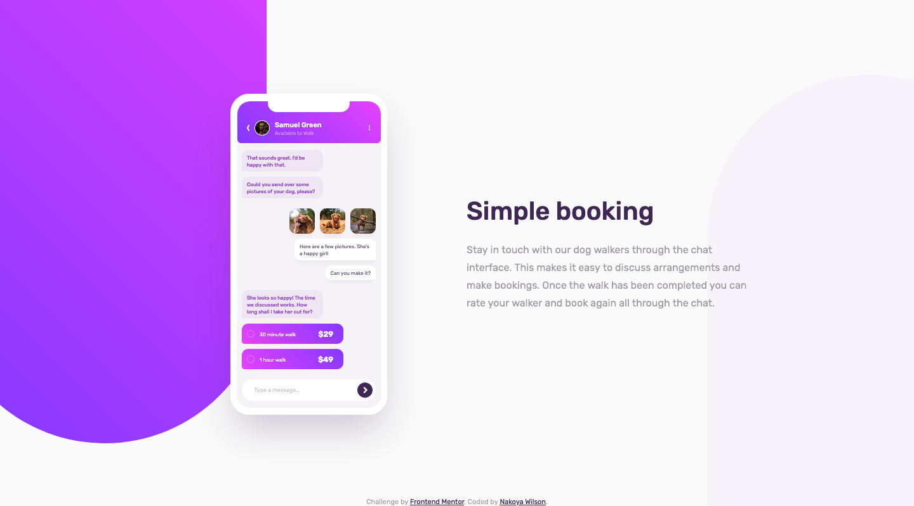

# Frontend Mentor - Chat app CSS illustration solution

This is a solution to the [Chat app CSS illustration challenge on Frontend Mentor](https://www.frontendmentor.io/challenges/chat-app-css-illustration-O5auMkFqY). Frontend Mentor challenges help you improve your coding skills by building realistic projects.

## Table of contents

- [Overview](#overview)
  - [The challenge](#the-challenge)
  - [Screenshot](#screenshot)
  - [Links](#links)
- [My process](#my-process)
  - [Built with](#built-with)
  - [Useful resources](#useful-resources)
- [Author](#author)

## Overview

### The challenge

Users should be able to:

- [x] View the optimal layout for the component depending on their device's screen size
- [] **Bonus**: See the chat interface animate on the initial load

### Screenshot

### Links

- Solution URL: [https://www.frontendmentor.io/solutions/mobile-first-chat-app-css-illustration-k2EQoeknf](https://www.frontendmentor.io/solutions/mobile-first-chat-app-css-illustration-k2EQoeknf)
- Live Site URL: [https://nakoyawilson.github.io/chat-app-css-illustration/](https://nakoyawilson.github.io/chat-app-css-illustration/)

## My process

### Built with

- HTML
- CSS
- Figma Design File
- Mobile-first workflow

### Useful resources

- [How can I align one item right with flexbox? - Stack Overflow](https://stackoverflow.com/questions/35269947/how-can-i-align-one-item-right-with-flexbox#:~:text=To%20align%20one%20flex%20child,items%20into%20distinct%20%22groups%22.)

## Author

- Website - [Nakoya Wilson](https://nakoyawilson.netlify.app/)
- Frontend Mentor - [@nakoyawilson](https://www.frontendmentor.io/profile/nakoyawilson)
- Twitter - [@nakoyawilson](https://twitter.com/nakoyawilson)
- LinkedIn - [@nakoyawilson](https://www.linkedin.com/in/nakoyawilson/)
